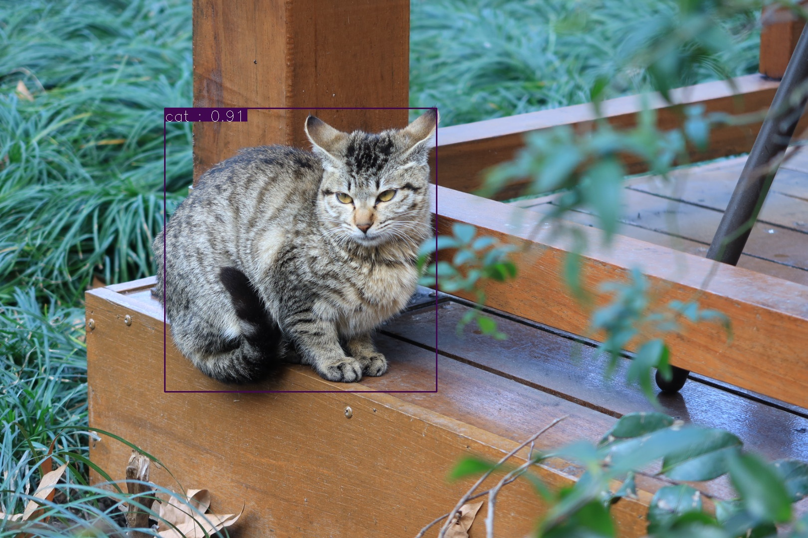

# YOLOv2 PyTorch Simple Implementation


本仓库是自己阅读 YOLOv2 论文时对其进行的复现。



在 PASCAL VOC 2007 数据集上进行测试，最终 mAP 值为 53.71%.

由于本人水平有限，该仓库的复现还有诸多不够完善的地方，可以在 Issues 中提出，我也会继续改进。

## 目录
- [YOLOv2 PyTorch Simple Implementation](#yolov2-pytorch-simple-implementation)
  - [目录](#%e7%9b%ae%e5%bd%95)
  - [安装](#%e5%ae%89%e8%a3%85)
  - [使用](#%e4%bd%bf%e7%94%a8)
    - [Inference on image](#inference-on-image)
    - [Inference on video](#inference-on-video)
    - [Evaluate on PASCAL VOC 2007 test dataset](#evaluate-on-pascal-voc-2007-test-dataset)
    - [Train on PASCAL VOC 2007 train dataset](#train-on-pascal-voc-2007-train-dataset)
  - [参考](#%e5%8f%82%e8%80%83)
  - [License](#license)
## 安装
需要安装以下依赖：
- Python >= 3.7
- PyTorch >= 1.4.0
- torchvision >= 0.5.0
- opencv-python >= 4.2.0.32
- Jupyter >= 1.0.0
- numpy >= 1.17.0
## 使用
### Inference on image
使用 Jupyter Notebook 打开 predict.ipynb。

默认在 GPU 上推理，如果需要在 CPU 上进行，请修改
```python
#device = torch.device('cuda')
device = torch.device('cpu')
```
下载预训练好的模型 YOLOv1_Resnet50.pth （[下载地址（提取码：s5h5）](https://pan.baidu.com/s/1OJe9J9Q4H0G0bxVQpImt7A)）并放在同一目录下。

在 Jupyter Notebook 中运行以下代码：
```python
predictImage(image_path)
```
例如：
```python
predictImage('testImage.JPG')
```
### Inference on video
使用 Jupyter Notebook 打开 predict.ipynb。

默认在 GPU 上推理，如果需要在 CPU 上进行，请修改
```python
#device = torch.device('cuda')
device = torch.device('cpu')
```
下载预训练好的模型 YOLOv2_Resnet50.pth （[下载地址（提取码：s5h5）](https://pan.baidu.com/s/1OJe9J9Q4H0G0bxVQpImt7A)）并放在同一目录下。

在 Jupyter Notebook 中运行以下代码：
```python
predictVideo(image_path)
```
例如：
```python
predictVideo('testVideo.mpeg')
```
### Evaluate on PASCAL VOC 2007 test dataset
使用 Jupyter Notebook 打开 eval.ipynb。

默认在 GPU 上推理，如果需要在 CPU 上进行，请修改
```python
#device = torch.device('cuda')
device = torch.device('cpu')
```

下载 PASCAL VOC 2007 test 数据集（[下载地址](http://host.robots.ox.ac.uk/pascal/VOC/voc2007/VOCtest_06-Nov-2007.tar)），并将其中的 JPEGImages 和 Annotations 单独放到一个目录。

下载预训练好的模型 YOLOv2_Resnet50.pth （[下载地址（提取码：s5h5）](https://pan.baidu.com/s/1OJe9J9Q4H0G0bxVQpImt7A)）并放在同一目录下。

在 Jupyter Notebook 中运行以下代码：
```python
eval(dir_path)
```
例如：
```python
eval('dataset/VOC2007test')
```
然后进入 mAP 目录：
```shell
cd mAP
```
命令行运行以下代码：
```shell
python main.py
```
### Train on PASCAL VOC 2007 train dataset
使用 Jupyter Notebook 打开 train.ipynb。

默认在 GPU 上推理，如果需要在 CPU 上进行，请修改
```python
#device = torch.device('cuda')
device = torch.device('cpu')
```
下载 PASCAL VOC 2007 train（[下载地址](http://host.robots.ox.ac.uk/pascal/VOC/voc2007/VOCtrainval_06-Nov-2007.tar)） & test（[下载地址](http://host.robots.ox.ac.uk/pascal/VOC/voc2007/VOCtest_06-Nov-2007.tar)）数据集，并将其中的 JPEGImages 和 Annotations 分别单独放到一个目录。

设置好数据集路径：
```python
train_data = PASCALVOC('dataset/VOC2007train', get_transform(train=True))
test_data = PASCALVOC('dataset/VOC2007test', get_transform(train=False))
```

下载 PyTorch 预训练好的模型  （[下载地址](https://download.pytorch.org/models/resnet50-19c8e357.pth)）并放在同一目录下。

其余超参数可以在源码中进行修改。
## 参考
- [PytorchNetHub](https://github.com/bobo0810/PytorchNetHub/tree/master/Yolov1_pytorch)
- [mAP](https://github.com/Cartucho/mAP)
## License
[GPL](https://github.com/Bil369/YOLOv2-PyTorch-Simple-Implementation/blob/master/LICENSE) &copy; [Bil369](https://github.com/Bil369)